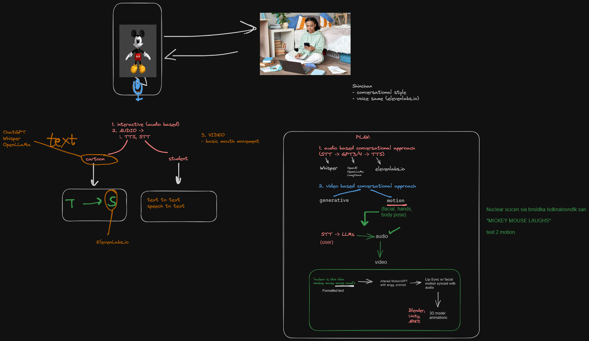

# Stemble Cartoon AI (we need a better name LOL)
This project aims to build a web app for keen learners, where they can learn any educational concept from their favorite cartoon characters.

So imagine, talking to **Mickey Mouse** and learning about **why the sky is blue**.

Here's our canvas screenshot from our first brainstorming session for Stemble's Cartoon AI

# Want to contribute?
For now, this project is an open-source project, which means any one can contribute to it. Code, design, animation, marketing, anything you can think of.

Here's how you can contribute:

1. Join Stemble's Discord server: https://discord.gg/JdGX6N553w
2. Visit the channel `#🎅—stemble-cartoon-app`
3. Let's talk there! 😄

# Current contributors
- Saud Hashmi (CTO, Stemble)
- Jaskirat Singh Sudan (ML Engineer)
- Shreytam Goyal (AI Enthusiast) 